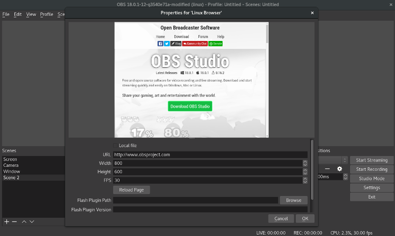

# About

This is a browser source plugin for [obs-studio](https://github.com/obsproject/obs-studio) based
on [Chromium Embedded Framework](https://bitbucket.org/chromiumembedded/cef). This plugin is Linux only.

Unfortunately, I was not able to make [obsproject/obs-browser](https://github.com/obsproject/obs-browser) work on Linux,
so I decided to create a separate plugin using the same engine, so both plugins should have feature parity in
terms of browser capabilities.

# Dependencies

* OBS-Studio
* libgconf

# Installing (binary release)

* Download the latest release from the [releases page](https://github.com/bazukas/obs-linuxbrowser/releases). Make sure the release version matches obs-studio version on your system [1].
* `mkdir -p $HOME/.config/obs-studio/plugins`
* Untar, e.g.: `tar -zxvf linuxbrowser0.6.1-obs23.0.2-64bit.tgz -C $HOME/.config/obs-studio/plugins/`
* Install the dependencies (see Dependencies section)

Arch Linux users can install obs-linuxbrowser from the official AUR packages [obs-linuxbrowser](https://aur.archlinux.org/packages/obs-linuxbrowser) or [obs-linuxbrowser-bin](https://aur.archlinux.org/packages/obs-linuxbrowser-bin).

You don't need to build the plugin if you've downloaded a binary release, instructions below are for people who want to compile the plugin themselves.

[1] Every binary release has the version number of OBS contained as part of the file name, e.g. “linuxbrowser0.6.1-obs23.0.2-64bit.tgz” refers to obs-linuxbrowser version 0.6.1 with OBS version 23.0.2.

# Building from source

**The following steps are NOT necessary, if you have already installed a binary release of obs-linuxbrowser!**

## Building CEF

* Download CEF minimal or standard binary release from http://opensource.spotify.com/cefbuilds/index.html [2]
* Extract and cd into folder
* Run `cmake ./ && make libcef_dll_wrapper`

[2] Due to unknown reasons certain CEF versions do not work properly with OBS-Studio. See issue [#63](https://github.com/bazukas/obs-linuxbrowser/issues/63) for a list of versions which have been confirmed to be working and to track progress on this issue.

## Building Plugin

Make sure you have obs-studio installed.

* `cd obs-linuxbrowser`
* `mkdir build`
* `cd build`
* `cmake -DCEF_ROOT_DIR=<path to your cef dir> ..` (don't forget the two dots at the end!) [3]
* `make`

[3] If you've installed OBS under an installation prefix other than `/usr` (meaning include files aren't located at `/usr/include/obs` and library files aren't located at `/usr/lib`), you need to set `OBS_ROOT_DIR` to reflect the actual installation prefix. If you don't know your installation prefix, you can also set `OBS_INCLUDE_SEARCH_DIR` to the location of your OBS installation's header files and `OBS_LIBRARY_SEARCH_DIR` to the location of your OBS installation's library (.so) files. *In most cases, though, this is NOT required at all.*

*Info: If you intend to install obs-linuxbrowser system wide (though the OBS developers don't recommend that), you can add `-DINSTALL_SYSTEMWIDE=true` to the CMake call. obs-linuxbrowser will then be installed to `/usr/lib/obs-plugins` (binaries) and `/usr/share/obs/obs-plugins/obs-linuxbrowser` (data).*

## Installing compiled sources

* Run `make install` to install all plugin binaries to `$HOME/.config/obs-studio/plugins`.
* Make sure to have all dependencies installed on your system

# Flash

You can enable flash by providing the path to your installed pepper flash library file and its version.
Some distributions provide packages with the plugin, but you can also extract one from google chrome installation.
The Flash version can be found in manifest.json that is usually found in same directory as .so file.

# JavaScript bindings
obs-linuxbrowser provides some JS bindings that are working the same way as the ones from obs-browser do. Additionally, a constant `window.obsstudio.linuxbrowser = true` has been introduced to allow the distinction between obs-browser and obs-linuxbrowser on the website.

All off the following bindings are children of `window.obsstudio`.

## Callbacks
* `onActiveChange(bool isActive)` – called whenever the source becomes activated or deactivated
* `onVisibilityChange(bool isVisible)` – called whenever the source is shown or hidden

## Constants
* `linuxbrowser = true` – Indicates obs-linuxbrowser is being used
* `pluginVersion` – A string containing the plugin's version

# Known issues
## obs-linuxbrowser does not compile with recent versions of CEF
Due to changes of the CEF API, recent versions of CEF are no longer compatible with obs-linuxbrowser. An attempt to solve this issue has been made and can be tried out by checking out the `fix-new-cef-api-108-110` branch. Unfortunately, this branch hasn't been merged to `master` yet due to the problems described in [#121](https://github.com/bazukas/obs-linuxbrowser/issues/121).

## OBS snap installation crashing when trying to create a Linuxbrowser object
**obs-linuxbrowser does not support Snap installations** as these have some known restrictions that make our plugin crash. Please install OBS your distribution's standard way (e.g. via APT, RPM, etc.).

See [#105](https://github.com/bazukas/obs-linuxbrowser/issues/105) for details.

## Old version of OBS not starting with new version of obs-linuxbrowser installed
Using obs-linuxbrowser with an older OBS version than the one which has been used for compilation makes OBS break. Compile obs-linuxbrowser with the same OBS version you are going to use for streaming/recording or select a binary release whose OBS version matches the same version as yours. If you've compiled obs-linuxbrowser yourself, recompile it with the older version of OBS.

## OBS-Linuxbrowser not displaying any content with certain versions of CEF
~~Some builds of CEF seem to be not working with obs-linuxbrowser.
We weren't able to figure out the exact cause of this, but we assume that it's a CEF-related issue we can't fix.
Check issue [#63](https://github.com/bazukas/obs-linuxbrowser/issues/63) for information about CEF versions that are known to be working.~~
This issue seems to have been resolved. If it occurs again, please open a new issue.

*Problems might also occur when updating CEF withouth recompiling obs-linuxbrowser afterwards. **Please make sure to recompile obs-linuxbrowser before opening issues concerning problems with certain CEF versions.***

## Transparency not working correctly: Transparent white browser content appears gray on white scene background.
As stated in issue [#58](https://github.com/bazukas/obs-linuxbrowser/issues/58), there is a limitation in CEF, making it unable to detect the background of the OBS scenes.
Instead, premultiplied alpha values are used, which somehow make transparent white colors appear gray (every color on the grayscale is a bit darker than normal when using transparency).
With a black background, transparency seems to be working out quite fine.

This issue cannot be fixed.

## OBS-Linuxbrowser not compiling, complaining about having to use ISO C++11 standard (old compiler versions)
~~See [#88](https://github.com/bazukas/obs-linuxbrowser/issues/88) for details. Some older compiler versions seem to have trouble with our current CMake setup. Using newer versions (e.g. GCC 8.x) should work.~~
This issue should've been resolved with versions 0.5.3 and above.

## OBS-Linuxbrowser crashing when using amdgpu
See [#89](https://github.com/bazukas/obs-linuxbrowser/issues/89) for details. obs-linuxbrowser seems to crash on machines using amdgpu drivers. Unfortunately, this issue cannot be fixed.
